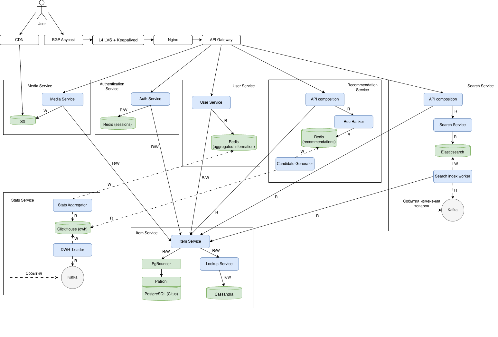

# Highload Ozon

## 1. Тема и целевая аудитория

### 1.1 Тема

Ozon — один из крупнейших маркетплейсов в России, предоставляющий инфраструктуру для взаимодействия между продавцами и конечными покупателями.

### 1.2 Функционал MVP:

**Для покупателя:**

- Регистрация, авторизация
- Просмотр каталога товаров
- Получение персональных рекомендаций товаров
- Поиск товаров
- Добавление товаров в корзину
- Оформление заказа
- Возможность оставить оценку и отзыв на товар

**Для продавца:**

- Регистрация, авторизация
- Добавление товаров на платформу
- Просмотр отзывов на свои товары
- Ответы на отзывы покупателей

### 1.3 Целевая аудитория

- **География:** более 95% пользователей приходятся на Россию
- **Размер аудитории:** [[1]](https://mediascope.net/data/#internet)
  - Месячный охват — 83 млн человек
  - Дневной охват — 43 млн человек

- **Гендерное распределение:** [[2]](https://delovoymir.biz/specifika-auditorii-raznyh-marketpleysov.html)
  - Женщины — 55%
  - Мужчины — 45%

- **Средний возраст пользователя:** 41 год
- **Среднее количество заказов:** 27 заказов в год [[3]](https://corp.ozon.ru/ru/sth/ebitda-ozon-v-1-kvartale-2025-goda-prevysila-32-mlrd-rubley-abdaa2d8)

## 2. Расчет нагрузки

### Продуктовые метрики

| Метрика                               | Значение   | Источник                                                                                                |
| ------------------------------------- | ---------- | ------------------------------------------------------------------------------------------------------- |
| MAU                                   | 83 000 000 | [[1]](https://mediascope.net/data/#internet)                                                            |
| DAU                                   | 43 000 000 | [[1]](https://mediascope.net/data/#internet)                                                            |
| Среднее заказов на пользователя в год | 27         | [[3]](https://corp.ozon.ru/ru/sth/ebitda-ozon-v-1-kvartale-2025-goda-prevysila-32-mlrd-rubley-abdaa2d8) |
| Активные продавцы                     | 600 000    | [[3]](https://corp.ozon.ru/ru/sth/ebitda-ozon-v-1-kvartale-2025-goda-prevysila-32-mlrd-rubley-abdaa2d8) |
| Оставляют отзыв                       | 19%        | [[4]](https://t-j.ru/opros-pro-otzyvy-rez/?utm_referrer=https%3A%2F%2Fwww.google.com%2F)                |
| Оставляют оценку                      | 36%        | [[4]](https://t-j.ru/opros-pro-otzyvy-rez/?utm_referrer=https%3A%2F%2Fwww.google.com%2F)                |
| Доля брошенных корзин                 | 70%        | [[5]](https://www.retailcrm.ru/blog/kak-sokratit-procent-broshennyh-korzin)                             |

#### Среднее количество действий пользователя по типам в день

| Тип действия              | Формула расчета              | Значение в день |
| ------------------------- | ---------------------------- | --------------- |
| Просмотр товаров          | 43 000 000 × 3 × 10          | 1 290 000 000   |
| Персональные рекомендации | 43 000 000 × 3 × 10          | 1 290 000 000   |
| Поиск товаров             | 43 000 000 × 3 × 2           | 258 000 000     |
| Оформление заказа         | 27 / 365 × 43 000 000        | 3 180 822       |
| Добавление в корзину      | 3 180 822 × 2.5 / 0.3        | 26 507 350      |
| Оценка товара             | 3 180 822 × 2.5 × 0.5 × 0.36 | 1 431 147       |
| Отзыв на товар            | 3 180 822 × 2.5 × 0.5 × 0.19 | 755 391         |
| Ответ продавца на отзыв   | 755 391 × 0.5                | 377 696         |
| Авторизация пользователя  | 43 000 000 × 0.05            | 2 150 000       |
| Регистрация пользователя  | 43 000 000 × 0.001           | 43 000          |
| Авторизация продавца      | 600 000 × 0.5                | 300 000         |
| Регистрация продавца      | 600 000 × 0.001              | 600             |
| Добавление товаров        | 600 000 \* 1                 | 600 000         |

### Технические метрики

#### RPS

Формула для расчета:

`Средний RPS = среднее количество действий пользователя по типам в день / 86400`

| Тип запроса               | Средний RPS | Пиковый RPS (x2) [[6]](https://habr.com/ru/companies/ozontech/articles/664472/) |
| ------------------------- | ----------- | ------------------------------------------------------------------------------- |
| Просмотр товаров          | 14 930      | 29 860                                                                          |
| Персональные рекомендации | 14 930      | 29 860                                                                          |
| Поиск товаров             | 2 986       | 5 972                                                                           |
| Оформление заказа         | 36.8        | 73.6                                                                            |
| Добавление в корзину      | 307         | 614                                                                             |
| Оценка товара             | 16.6        | 33.2                                                                            |
| Отзыв на товар            | 8.7         | 17.4                                                                            |
| Ответ продавца на отзыв   | 4.37        | 8.74                                                                            |
| Авторизация пользователя  | 24.9        | 49.8                                                                            |
| Регистрация пользователя  | 0.5         | 1.0                                                                             |
| Авторизация продавца      | 3.47        | 6.94                                                                            |
| Регистрация продавца      | 3.47        | 6.94                                                                            |
| Добавление товаров        | 6.94        | 13.88                                                                           |
| **Итого**                 | ~33 259     | ~66 518                                                                         |

#### Объем хранилища

| Тип данных       | Средний размер | Количество объектов | Общий объем (ТБ) | Прирост в день (кол-во) | Прирост в день (ГБ) | Прирост в месяц (ГБ) | Прирост в год (ГБ) |
| ---------------- | -------------- | ------------------- | ---------------- | ----------------------- | ------------------- | -------------------- | ------------------ |
| Пользователи     | 2 КБ           | 83 000 000          | 0.155            | 43 000                  | 0.082               | 2.46                 | 29.52              |
| Продавцы         | 3 КБ           | 600 000             | 0.0017           | 600                     | 0.0017              | 0.051                | 0.612              |
| Товары           | 2 КБ           | 250 000 000         | 0.466            | 600 000                 | 1.1444              | 34.332               | 411.984            |
| Товары медиа     | 22.5 МБ        | 250 000 000         | 5 364            | 600 000                 | 13 184.8            | 395 544              | 4 746 528          |
| Корзины          | 2 КБ           | 26 507 350          | 0.0494           | 10 602 940              | 20.41               | 612.3                | 7 347.6            |
| Заказы           | 3 КБ           | 1 160 000 030       | 0.0032           | 3 180 822               | 9.54                | 286.2                | 3 434.4            |
| Оценки           | 0.5 КБ         | 522 368 655         | 0.00024          | 1 431 147               | 0.70                | 21.0                 | 252.0              |
| Отзывы           | 1 КБ           | 275 717 715         | 0.00026          | 755 391                 | 0.72                | 21.6                 | 259.2              |
| Ответы продавцов | 1 КБ           | 137 859 040         | 0.00013          | 377 696                 | 0.36                | 10.8                 | 129.6              |
| История поиска   | 0.2 КБ         | 15 480 000 000      | 0.0029           | 258 000 000             | 49.21               | 1 476.3              | 17 715.6           |
| **Итого**        |                |                     | **5 364.6788**   | **277 592 596**         | **13 266.9671**     | **398 008.043**      | **4 776 108.516**  |

Средний размер медиа одного товара рассчитан следующим образом:  
5 фотографий по 0.5 МБ,  
1 видео размером 20 МБ

Количество заказов, оценок, отзывов и ответов продавцов рассчитано за год

История поиска за 2 месяца

#### Сетевой трафик

Формула для расчета:

`Пиковое потребление = пиковый RPS * средний размер ответа (Кб) * 8 * 1024 / 1 000 000 000  ~ пиковый RPS * средний размер ответа (Кб) / 122070 `

`Суточный трафик = запросов в день * средний размер ответа (Кб) / (1024 * 1024)`

| Тип запроса                   | Средний размер ответа (КБ) | Пиковое потребление (Гбит/с)          | Суточный трафик (ГБ/сутки)                        |
| ----------------------------- | -------------------------- | ------------------------------------- | ------------------------------------------------- |
| Просмотр информации о товарах | 2                          | 29 860 \* 2 / 122070 ≈ 0.489          | 1 290 000 000 * 2 / (1024*1024) ≈ 2 460           |
| Просмотр медиа товаров        | 23 040                     | 29 860 \* 23 040 / 122070 ≈ 5 633.652 | 1 290 000 000 * 23 040 / (1024*1024) ≈ 28 344 727 |
| Персональные рекомендации     | 200                        | 29 860 \* 200 / 122070 ≈ 48.925       | 1 290 000 000 * 200 / (1024*1024) ≈ 12 298        |
| Поиск товаров                 | 200                        | 5 972 \* 200 / 122070 ≈ 9.785         | 258 000 000 * 200 / (1024*1024) ≈ 49 210          |
| Оформление заказа             | 3                          | 73.6 \* 3 / 122070 ≈ 0.00181          | 3 180 822 * 3 / (1024*1024) ≈ 9.10                |
| Добавление в корзину          | 2                          | 614 \* 2 / 122070 ≈ 0.01006           | 26 507 350 * 2 / (1024*1024) ≈ 50.6               |
| Оценка товара                 | 1                          | 33.2 \* 1 / 122070 ≈ 0.000272         | 1 431 147 * 1 / (1024*1024) ≈ 1.37                |
| Отзыв на товар                | 2                          | 17.4 \* 2 / 122070 ≈ 0.000285         | 755 391 * 2 / (1024*1024) ≈ 1.44                  |
| Ответ продавца на отзыв       | 2                          | 8.74 \* 2 / 122070 ≈ 0.000143         | 377 696 * 2 / (1024*1024) ≈ 0.72                  |
| Авторизация пользователя      | 1                          | 49.8 \* 1 / 122070 ≈ 0.000408         | 2 150 000 * 1 / (1024*1024) ≈ 2.06                |
| Регистрация пользователя      | 2                          | 1.0 \* 2 / 122070 ≈ 0.0000164         | 43 000 * 2 / (1024*1024) ≈ 0.082                  |
| Авторизация продавца          | 1                          | 6.94 \* 1 / 122070 ≈ 0.0000568        | 300 000 * 1 / (1024*1024) ≈ 0.286                 |
| Регистрация продавца          | 3                          | 6.94 \* 3 / 122070 ≈ 0.000171         | 600 * 3 / (1024*1024) ≈ 0.00172                   |
| Добавление товаров            | 2                          | 13.88 \* 2 / 122070 ≈ 0.000227        | 600 000 * 2 / (1024*1024) ≈ 1.145                 |
| **Итого**                     | -                          | ~ 5 693.354                           | ~ 28 461 107                                      |

## Глобальная балансировка нагрузки

### Функциональное разбиение по доменам

| Домен          | Назначение                                  |
| -------------- | ------------------------------------------- |
| www.ozon.ru    | Основной интерфейс для покупателей          |
| seller.ozon.ru | Основной интерфейс для продавцов            |
| api.ozon.ru    | API для мобильных приложений и веб-клиентов |

### Расположение датацентров

Большая часть аудитории (более 95%) находится в России. Пользователи маркетплейса распределены практически по всей территории страны, что видно из распределения кластеров [[7]](https://dostavka.mphub.ru/blog/klastery-i-sklady-ozon-adresa-prioritety-karta-pokrytija/). Поэтому рационально разместить ДЦ в Москве, Санкт-Петербурге, Екатеринбурге и Новосибирске.

### Схема глобальной балансировки

Для автоматического и оптимального распределения пользовательских запросов между ДЦ предлагается использовать схему балансировки BGP Anycast.

## Локальная балансировка нагрузки

Используем трёхуровневую схему балансировки:

**Client → L4 → L7 → Backend**

### L4

После попадания трафика в ДЦ L4-балансировщик (LVS) распределяет соединения на ноды Nginx (L7) с помощью Virtual Server via Direct Routing (DSR). Алгоритм балансировки: Least Connections.

Для обеспечения отказоустойчивости применяется Keepalived: один балансировщик работает как главный, остальные — резервные. Если главный балансировщик выходит из строя, один из резервных автоматически берёт на себя его функции. Кроме того, Keepalived выполняет проверку работоспособности компонентов и может осуществлять логирование.

**Формула резервирования:** N\*2

### L7

Трафик с L4 принимают ноды Nginx. Они выполняют SSL Termination с использованием TLS session ticket, который позволяет клиенту повторно подключаться без полного TLS handshake. После расшифровки HTTPS-запросы распределяются на инстансы бэкенда. Алгоритм балансировки: Least Connections.

**Формула резервирования:** N+1

### Backend

Кластером инстансов бэкенда управляет Kubernetes.

**Формула резервирования:** N+1

## Логическая схема БД

| Таблица                  | Описание                                                         |
| ------------------------ | ---------------------------------------------------------------- |
| `users`                  | Общая информация о пользователях                                 |
| `sellers`                | Информация о продавцах и их магазинах                            |
| `products`               | Основная информация о товарах                                    |
| `categories`             | Категории товаров                                                |
| `product_media`          | Связь товаров с медиафайлами                                     |
| `files`                  | Информация о файлах (изображения товаров и т.д.)                 |
| `product_ratings`        | Агрегированная информация о рейтинге товара и количестве отзывов |
| `product_purchase_stats` | Агрегированная информация о количестве покупок товара            |
| `carts`                  | Корзины пользователей                                            |
| `orders`                 | Заказы пользователей                                             |
| `addresses`              | Адреса доставки                                                  |
| `reviews`                | Отзывы и оценки пользователей о товарах                          |
| `review_replies`         | Ответы продавцов на отзывы покупателей                           |
| `user_actions`           | Журнал действий пользователей для аналитики                      |
| `recommendations`        | Персональные рекомендации товаров для пользователя               |

### Расчет размеров таблиц и QPS

| Название таблицы           | Расчет размера строки                                                                                                                                                         | Количество строк | Размер таблицы | Нагрузка на запись (QPS, пик) | Нагрузка на чтение (QPS, пик) |
| -------------------------- | ----------------------------------------------------------------------------------------------------------------------------------------------------------------------------- | ---------------: | -------------: | ----------------------------: | ----------------------------: |
| **users**                  | `id(8) + email(255) + phone(20) + password_hash(60) + name(100) + role(20) + session(256) + session_expires_at(8) + created_at/updated_at(16)`  **≈ 743 Б**                |           83 млн |  **≈ 57.4 ГБ** |                      **57.7** |                      **56.7** |
| **addresses**              | `id(8) + user_id(8) + city(100) + street(200) + house(20) + apartment(20) + comment(500) + type(20) + created_at/updated_at(16)`  **≈ 892 Б**                              |          166 млн | **≈ 137.9 ГБ** |                       **3.7** |                      **73.6** |
| **files**                  | `id(8) + url(500) + type(50) + size(8) + storage_provider(50) + created_at/updated_at(16)`  **≈ 632 Б**                                                                    |         1.5 млрд | **≈ 882.9 ГБ** |                      **83.3** |                  **65 694.4** |
| **sellers**                | `id(8) + user_id(8) + store_name(255) + description(1000) + rating(8) + created_at/updated_at(16)`  **≈ 1.27 КБ**                                                          |          600 000 |  **≈ 0.72 ГБ** |                      **0.01** |                       **6.9** |
| **categories**             | `id(8) + name(100) + parent_id(8) + created_at/updated_at(16)`  **≈ 132 Б**                                                                                                |        < 100 000 |    **< 13 МБ** |                     **редко** |                  **35 833.3** |
| **products**               | `id(8) + seller_id(8) + category_id(8) + title(255) + description(2000) + price(8) + stock(4) + status(20) + created_at/updated_at(16)`  **≈ 2.27 КБ**                     |          250 млн | **≈ 541.8 ГБ** |                      **13.9** |                  **65 694.4** |
| **product_media**          | `id(8) + product_id(8) + file_id(8) + position(2) + created_at/updated_at(16)`  **≈ 42 Б**                                                                                 |         1.5 млрд |  **≈ 58.7 ГБ** |                      **83.3** |                  **65 694.4** |
| **product_ratings**        | `id(8) + product_id(8) + rating(8) + reviews_count(4) + created_at/updated_at(16)`  **≈ 44 Б**                                                                             |          250 млн |  **≈ 10.2 ГБ** |                      **33.1** |                  **65 694.4** |
| **product_purchase_stats** | `id(8) + product_id(8) + purchases_count(8) + created_at/updated_at(16)`  **≈ 40 Б**                                                                                       |          250 млн |   **≈ 9.3 ГБ** |                     **184.1** |                  **29 861.1** |
| **user_actions**           | `id(8) + user_id(8) + product_id(8) + action_type(50) + action_source(50) + session_id(100) + action_value(8) + action_text(500) + created_at/updated_at(16)`  **≈ 750 Б** |      ≈ 1.05 трлн |   **≈ 715 ТБ** |                  **66 483.0** |                   **6 648.3** |
| **recommendations**        | `id(8) + user_id(8) + recommended_product_ids + scores + expires_at(8) + created_at/updated_at(16)`  **≈ 360 Б**                                                           |           83 млн |  **≈ 27.8 ГБ** |                   **1 921.3** |                   **1 493.1** |
| **carts**                  | `id(8) + user_id(8) + product_ids + quantities + created_at/updated_at(16)`  **≈ 62 Б**                                                                                    |           43 млн |   **≈ 2.5 ГБ** |                     **613.6** |                     **306.8** |
| **orders**                 | `id(8) + user_id(8) + delivery_address_id(8) + product_ids + quantities + prices + total_price(8) + status(20) + created_at/updated_at(16)`  **≈ 118 Б**                   |        1.16 млрд | **≈ 127.5 ГБ** |                      **73.6** |                      **73.6** |
| **reviews**                | `id(8) + product_id(8) + user_id(8) + rating(1) + text(1000) + created_at/updated_at(16)`  **≈ 1.02 КБ**                                                                   |        ≈ 276 млн | **≈ 267.6 ГБ** |                      **17.5** |                   **2 986.1** |
| **review_replies**         | `id(8) + review_id(8) + seller_id(8) + text(1000) + created_at/updated_at(16)`  **≈ 1.02 КБ**                                                                              |        ≈ 138 млн | **≈ 133.5 ГБ** |                       **8.7** |                   **2 986.1** |

## Физическая схема БД

### Выбор хранилищ

Для транзакционных сущностей (`users`, `orders`, `carts`, `addresses`, `products`, `reviews`) используется PostgreSQL с расширением Citus

Причины выбора:

- PostgreSQL обеспечивает ACID-гарантии, что критично для заказов, корзин, пользователей и адресов доставки
- поддерживает сложные запросы, JOIN'ы и вторичные индексы
- Citus позволяет горизонтально масштабировать PostgreSQL за счёт шардирования

Для событийных и аналитических данных используется ClickHouse

Для таблиц с агрегированной информацией и рекомендаций используется Redis, поскольку требуется быстрый доступ по ключу и значения переодически пересчитываются

Для маршрутизации запросов по дополнительным полям (не по ключам шардирования) используется Cassandra, в которой хранится lookup-таблица с соответствием ключа и шарда

### Размещение таблиц

| Таблица                  | Хранилище          |
| ------------------------ | ------------------ |
| `users`                  | PostgreSQL (Citus) |
| `sellers`                | PostgreSQL (Citus) |
| `products`               | PostgreSQL (Citus) |
| `categories`             | PostgreSQL (Citus) |
| `files`                  | PostgreSQL (Citus) |
| `product_media`          | PostgreSQL (Citus) |
| `carts`                  | PostgreSQL (Citus) |
| `orders`                 | PostgreSQL (Citus) |
| `addresses`              | PostgreSQL (Citus) |
| `reviews`                | PostgreSQL (Citus) |
| `review_replies`         | PostgreSQL (Citus) |
| `user_actions`           | ClickHouse         |
| `product_ratings`        | Redis              |
| `product_purchase_stats` | Redis              |
| `recommendations`        | Redis              |
| `shard_lookup`           | Cassandra          |

Для данных в Redis источником истины является ClickHouse. Для Redis настраиваются RDB snapshot'ы. И схема работы будет следующей:

- при штатной работе Redis хранит горячие агрегаты и рекомендации
- при падении Redis данные восстанавливаются из snapshot
- по расписанию, например ночью, Redis полностью или частично переобновляется из ClickHouse
- при необходимости можно пересчитывать только изменившиеся ключи

### Индексы

| Таблица          | Состав индекса                                                           | Пояснение                                                            |
| ---------------- | ------------------------------------------------------------------------ | -------------------------------------------------------------------- |
| `users`          | 1) `email, id` 2) `phone, id` 3) `session, session_expires_at, id` | Поиск пользователя по email, телефону и активной сессии              |
| `sellers`        | 1) `user_id, id`                                                         | Получение профиля продавца по пользователю                           |
| `products`       | 1) `seller_id, id` 2) `category_id, price, id`                        | Список товаров продавца, список товаров каталога по категории и цене |
| `categories`     | 1) `parent_id, id`                                                       | Построение дерева категорий                                          |
| `product_media`  | 1) `product_id, position, file_id`                                       | Получение медиа товара в нужном порядке                              |
| `carts`          | 1) `user_id, id`                                                         | Поиск корзины пользователя                                           |
| `orders`         | 1) `user_id, created_at, id` 2) `user_id, status, created_at, id`     | История заказов пользователя и текущие заказы пользователя           |
| `addresses`      | 1) `user_id, id`                                                         | Список адресов пользователя                                          |
| `reviews`        | 1) `product_id, user_id, id` 2) `product_id, created_at, id`          | Получение отзыва пользователя, получение отзывов о товаре            |
| `review_replies` | 1) `review_id, id`                                                       | Получение ответа на конкретный отзыв                                 |

### Шардирование

| Компонент                | Подход                                                                      |
| ------------------------ | --------------------------------------------------------------------------- |
| `users`                  | Хеш-шардирование по `id`                                                    |
| `sellers`                | Хеш-шардирование по `id`                                                    |
| `products`               | Хеш-шардирование по `id`                                                    |
| `categories`             | Репликация на все узлы                                                      |
| `files`                  | Хеш-шардирование по `id`                                                    |
| `product_media`          | Хеш-шардирование по `product_id`                                            |
| `carts`                  | Хеш-шардирование по `user_id`                                               |
| `orders`                 | Хеш-шардирование по `user_id`                                               |
| `addresses`              | Хеш-шардирование по `user_id`                                               |
| `reviews`                | Хеш-шардирование по `product_id`                                            |
| `review_replies`         | Хеш-шардирование по `review_id`                                             |
| `user_actions`           | Шардирование по `user_id`, внутри шарда — партиционирование по `created_at` |
| `product_ratings`        | Redis Cluster, ключ `product_rating:{product_id}`                           |
| `product_purchase_stats` | Redis Cluster, ключ `product_purchase_stats:{product_id}`                   |
| `recommendations`        | Redis Cluster, ключ `user_recommendations:{user_id}`                        |

Cassandra используется как lookup-индекс для определения нужного шарда при запросах не по ключу шардирования. Вместо проходки по всем шардам сначала выполняется запрос в Cassandra (`ключ → shard_id`), после чего обращение идёт только в нужный PostgreSQL-шард

### Резервирование

| Компонент                                                                                                                           | Подход                                  |
| ----------------------------------------------------------------------------------------------------------------------------------- | --------------------------------------- |
| `users`, `sellers`, `products`, `categories`, `files`, `product_media`, `carts`, `orders`, `addresses`, `reviews`, `review_replies` | Master-Slave (1 sync + 1 async)         |
| `user_actions`                                                                                                                      | ReplicatedMergeTree (2 реплики на шард) |
| `product_ratings`, `product_purchase_stats`, `recommendations`                                                                      | Redis Cluster + RDB snapshot            |
| `shard_lookup`                                                                                                                      | Cassandra RF=3                          |

### Схема резервного копирования

| Компонент          | Подход                                                                                       |
| ------------------ | -------------------------------------------------------------------------------------------- |
| PostgreSQL (Citus) | Full backup 1 раз в день + архивирование WAL каждые 15 минут                                 |
| ClickHouse         | Full backup 1 раз в день                                                                     |
| Redis              | RDB snapshot по расписанию + периодическое полное или частичное переобновление из ClickHouse |
| Cassandra          | Snapshot + инкрементальные backup'ы SSTable                                                  |

## 7. Алгоритмы

### Поиск

При добавлении или обновлении товара, а также при обработке пользовательского запроса к тексту применяется нормализация. Текст из карточки товара или из запроса переводится в нижний регистр, очищается от лишних символов и разбивается на токены.

Основой поиска является **Inverted Index** — структура данных вида «терм → множество документов», которая позволяет быстро находить все товары, содержащие заданное слово. После нормализации из всех товаров формируется словарь термов, и для каждого терма фиксируется множество документов (товаров), в которых он встречается. Для хранения индекса используется Elasticsearch.

Для предоставления подсказок во время ввода поискового запроса используется **Prefix Search** — алгоритм поиска по префиксу строки. Поиск выполняется не по всему каталогу товаров, а по заранее подготовленному набору строк: популярным поисковым запросам, названиям брендов, категориям и моделям товаров. Для этого в Elasticsearch создаётся отдельный suggest-индекс: «префикс → возможные варианты». Когда пользователь вводит очередной символ, введённая строка тоже нормализуется, после чего выполняется поиск по совпадению с уже сохранёнными префиксами.

После отправки запроса используется построенный Inverted Index. Запрос проходит ту же нормализацию, затем по каждому терму извлекается множество товаров. Эти множества пересекаются, формируя список кандидатов — товаров, содержащих термы запроса.

Если количество найденных кандидатов ниже порога или в запросе обнаружены токены, отсутствующие в словаре индекса, применяется **Fuzzy Search**. Это алгоритм поиска с учётом ошибок ввода, основанный на нахождении расстояний между словами. Для каждого терма запроса генерируются близкие по написанию варианты, после чего поиск повторяется уже по этим вариантам.

После получения кандидатов они ранжируются по `score`, который вычисляется с помощью **BM25** и взвешенной суммы по отдельным полям документа. BM25 — это алгоритм ранжирования, который вычисляет, насколько документ соответствует поисковому запросу.

Алгоритм работает следующим образом:

1. По каждому терму запроса проверяется, встречается ли он в поле документа.
2. Если терм встречается, вычисляется его вклад: одно совпадение увеличивает релевантность, повторные совпадения тоже увеличивают её, но с убывающим эффектом.
3. Затем этот вклад умножается на обратную частоту вхождения: редкие термы усиливают score сильнее, чем часто встречающиеся.
4. После этого применяется нормализация по длине поля.
5. Вклады всех термов суммируются, и получается BM25-score данного поля.

Так как разные поля товара имеют разную важность, итоговый score рассчитывается как взвешенная сумма BM25 по отдельным полям документа:

`score(d, q) = 3 * BM25(q, title_d) + 2 * BM25(q, brand_d) + 1 * BM25(q, description_d)`

где:

- `q` — поисковый запрос
- `d` — документ, соответствующий товару
- `title_d`, `brand_d`, `description_d` — соответствующие поля документа

### Рекомендации

Для персональных рекомендаций применяется коллаборативная фильтрация. На основе пользовательских действий строится матрица, у которой строки соответствуют пользователям, столбцы — товарам, а в ячейке хранится вес взаимодействия пользователя с товаром. Например, просмотру соответствует вес `1`, добавлению в корзину — `2`, покупке — `3`. Далее каждый товар рассматривается как вектор по всем пользователям, и для каждой пары товаров рассчитывается их близость (по углу между векторами). Пользователям рекомендуются наиболее похожие на купленные или просмотренные ими товары.

Для рекомендаций похожих товаров каждый товар представляется в виде вектора признаков, включающего категорию, бренд, цену, характеристики и текстовое описание. Чем меньше угол между векторами, тем более похожими считаются товары. Пользователю показываются наиболее похожие на текущий товары.

Для новых пользователей и новых товаров рекомендации формируются на основе агрегированных метрик: количества покупок, просмотров, добавлений в корзину и рейтинга товара. Товары сортируются по популярности и показываются пользователю без учёта персональной истории.

## 8. Технологии

| Технология                 | Область примемения                                                | Мотивационная часть                                                                                                                                                                                                                               |
| -------------------------- | ----------------------------------------------------------------- | ------------------------------------------------------------------------------------------------------------------------------------------------------------------------------------------------------------------------------------------------- |
| Golang                     | Основная бизнес-логика backend и микросервисы                     | Поддержка многопоточности и микросервисной архитектуры Высокая производительность Быстрая разработка                                                                                                                                        |
| TypeScript + React + Redux | Frontend                                                          | React подходит для построения сложного SPA-интерфейса Redux удобен для централизованного управления состоянием приложения TypeScript обеспечивает статическую типизацию и упрощает поддержку кода                                           |
| Python                     | Алгоритмы рекомендаций                                            | Большое число библиотек для ML и работы с данными                                                                                                                                                                                                 |
| PostgreSQL (Citus)         | Основное транзакционное хранилище данных                          | Обеспечивает надёжность и транзакционность (ACID) Citus добавляет горизонтальное шардирование и позволяет масштабировать нагрузку на чтение и запись                                                                                           |
| ClickHouse                 | Хранение событий пользовательских действий и аналитических данных | Оптимизирован под высокопроизводительные аналитические запросы по большим объёмам данных                                                                                                                                                          |
| Redis                      | Хранение горячих агрегатов и рекомендаций                         | Быстрое in-memory хранилище Обеспечивает минимальную задержку доступа по ключу                                                                                                                                                                 |
| Elasticsearch              | Полнотекстовый поиск товаров и подсказки                          | Поддерживает использованные алгоритмы поиска Хорошо подходит для полнотекстового поиска по большому каталогу товаров                                                                                                                           |
| Cassandra                  | Lookup-индекс для маршрутизации запросов по шардам                | Эффективно работает как распределённое key-value хранилище                                                                                                                                                                                        |
| S3                         | Хранение медиафайлов товаров                                      | Объектная структура хранения хорошо подходит для медиафайлов Отсутствие жёсткой файловой иерархии упрощает масштабирование и распределённое хранение Позволяет хранить большие бинарные данные вне основной БД и обращаться к ним по ссылке |
| Kafka                      | Асинхронная передача событий между сервисами                      | Сообщения между сервисами должны обрабатываться асинхронно и надёжно Kafka обеспечивает масштабируемую очередность и доставку событий в реальном времени                                                                                       |
| Docker                     | Контейнеризация сервисов                                          | Обеспечивает единое окружение для запуска сервисов Упрощает сборку, доставку и развертывание приложений                                                                                                                                        |
| Kubernetes                 | Управление контейнеризированными приложениями                     | Автоматизация развертывания и масштабирования сервисов Повышение отказоустойчивости и удобство эксплуатации                                                                                                                                    |
| Nginx                      | L7-балансировка, SSL-терминация, отдача статики                   | Лёгкий и производительный веб-сервер Позволяет эффективно балансировать запросы и разгружать backend                                                                                                                                           |
| Prometheus + Grafana       | Мониторинг и визуализация метрик                                  | Автоматический сбор метрик Визуализация нагрузки, задержек и ошибок Поддержка алертов                                                                                                                                                       |

## 9. Схема проекта

| Компонент                                | Назначение                                                                                                                  |
| ---------------------------------------- | --------------------------------------------------------------------------------------------------------------------------- |
| User                                     | Конечный пользователь системы                                                                                               |
| BGP Anycast                              | Направляет пользовательский трафик в ближайший или доступный датацентр, обеспечивая отказоустойчивость и снижение задержек  |
| CDN                                      | Кэширует и быстро отдает статический контент пользователям                                                                  |
| S3                                       | Хранит статические и медиафайлы                                                                                             |
| L4 LVS + Keepalived                      | Балансирует сетевые соединения между фронтовыми узлами и обеспечивает отказоустойчивость балансировщиков                    |
| Nginx                                    | Выполняет reverse proxy, SSL termination и маршрутизацию HTTP-запросов во внутренние сервисы                                |
| API Gateway                              | Единая точка входа для клиентских запросов. Маршрутизирует запросы в доменные сервисы, скрывая внутреннюю структуру системы |
| Auth Service                             | Обрабатывает регистрацию, вход в систему, проверку сессий и аутентификацию пользователей                                    |
| Redis (sessions)                         | Хранит пользовательские сессии и данные авторизации                                                                         |
| Media Service                            | Управляет загрузкой, хранением и выдачей медиафайлов, а также взаимодействием с S3                                          |
| User Service                             | Управляет основной бизнес-логикой и данными пользователей/сущностей                                                         |
| Lookup Service                           | Определяет, в какое хранилище или шард направить запрос, и инкапсулирует логику lookup                                      |
| PostgreSQL (Citus)                       | Основное OLTP-хранилище для транзакционных данных                                                                           |
| Cassandra                                | Хранит lookup-данные для быстрого определения нужного шарда по ключу                                                        |
| Redis                                    | Хранит горячие данные для быстрого доступа                                                                                  |
| Hash Service                             | Обрабатывает и подготавливает данные для записи в аналитическое хранилище                                                   |
| ClickHouse                               | Аналитическое хранилище (DWH) для событий, метрик и данных, используемых в аналитике и рекомендациях                        |
| Stat Service                             | Собирает и обрабатывает статистику и события для загрузки в ClickHouse                                                      |
| Kafka                                    | Передает события между сервисами асинхронно: изменения сущностей, товаров, действия пользователей и события для индексации  |
| Recommendation Service                   | Сервис, отвечающий за формирование и выдачу рекомендаций                                                                    |
| api composition (Recommendation Service) | Агрегирует данные и координирует внутренние компоненты сервиса рекомендаций                                                 |
| Items DB (Recommendation Service)        | Хранилище товарных данных, используемых для построения рекомендаций                                                         |
| Rec Request Filler                       | Подготавливает и обогащает входные данные для построения рекомендаций                                                       |
| Redis (recommendations)                  | Хранит заранее подготовленные списки рекомендаций                                                                           |
| Candidate Generator                      | Формирует набор кандидатов для рекомендаций на основе доступных данных и признаков                                          |
| Rec Ranker                               | Ранжирует кандидатов и выбирает наиболее релевантные рекомендации                                                           |
| Search Service                           | Сервис, отвечающий за поиск товаров                                                                                         |
| api composition (Search Service)         | Агрегирует данные и координирует внутренние компоненты поискового сервиса                                                   |
| Items DB (Search Service)                | Хранилище товарных данных, используемых в поиске                                                                            |
| search app                               | Выполняет обработку поисковых запросов, обращается к Elasticsearch и возвращает результаты                                  |
| Elasticsearch                            | Хранит полнотекстовый индекс товаров и используется для быстрого поиска, фильтрации и ранжирования результатов              |
| Search index worker                      | Читает события из Kafka и обновляет поисковый индекс в Elasticsearch при изменении товаров или связанных данных             |
| PgBouncer                                | Пул соединений к PostgreSQL. Снижает нагрузку на БД за счёт переиспользования подключений и ограничения числа одновременных соединений |
| Patroni                                  | Управляет кластером PostgreSQL, отслеживает состояние master-узла и выполняет автоматическое переключение на реплику при отказе |

## 10. Обеспечение надежности

| Компонент | Способ обеспечения надёжности |
| --- | --- |
| **Nginx** | Разворачивается в двух экземплярах по схеме Active-Passive. Один узел работает как основной и принимает весь трафик, второй — резервный. Если активный инстанс выходит из строя, резервный автоматически продолжает обслуживать запросы.  Схема резервирования: **N+1** |
| **Backend-сервисы** | Graceful shutdown: 1. Останавливаем приём новых задач; 2. Даем время на завершение активных запросов; 3. Дожидаемся окончания работы всех горутин; 4. Завершаем работу сервиса. Схема резервирования: **N+1** |
| **PostgreSQL (Citus)** | Master-Slave: 1 синхронная + 1 асинхронная реплика. Для повышения надежности используется Patroni. Он отслеживает состояние узлов и при отказе master автоматически его заменяет. Graceful shutdown: 1. Перестаем принимать новый трафик; 2. Завершаем текущие запросы; 3. Завершаем работу; Схема резервирования: **full backup 1 раз в сутки + WAL каждые 15 минут** |
| **ClickHouse** | Аналитические данные хранятся в ReplicatedMergeTree с 2 репликами на каждый shard. Graceful shutdown: 1) Перестаем принимать новый трафик; 2) Завершаем текущие запросы; 4) Останавливаем формирование новых INSERT-батчей; 4) Делаем Flush всех накопленных данных в ClickHouse; 5) Завершаем работу ClickHouse Схема резервирования: **full backup 1 раз в сутки** |
| **Redis** | Redis Cluster + RDB snapshot по расписанию + периодическое полное или частичное переобновление из ClickHouse |
| **Cassandra** | Кластер Cassandra с **Replication Factor = 3** |
| **Kafka** | Кластер из нескольких брокеров. Репликация партиций между брокерами, **Replication Factor = 3**. У каждой партиции один лидер и follower-реплики. При отказе лидера лидерство передаётся одной из реплик. Graceful shutdown:  1) запись накопленных данных из памяти на диск, 2) перенос лидерства партиций на другие брокеры. |
| **Elasticsearch** | Схема резервирования: **1 реплика на шард** |

## 11. Расчет ресурсов

## Список сервисов

| Компонент | Пиковый RPS | Характер сервиса | CPU | RAM | Трафик |
|---|---:|---|---:|---:|---:|
| **L4 LVS + Keepalived** | 66 518 | L4-балансировка | 128 vCPU | 256 GB | 5 693.354 Гбит/с |
| **Nginx** | 66 518 | L7-балансировка, SSL termination | 384 vCPU | 1.5 TB | 5 693.354 Гбит/с |
| **Kubernetes** | 66 518 | Оркестрация backend-сервисов | 768 vCPU | 3 TB | 60 Гбит/с |
| **API Gateway** | 66 518 | Лёгкая бизнес-логика | 48 vCPU | 24 GB | 60 Гбит/с |
| **Auth Service** | 64.68 | Лёгкая бизнес-логика | 2 vCPU | 2 GB | 0.00065 Гбит/с |
| **User Service** | 747.94 | Средняя бизнес-логика | 128 vCPU | 128 GB | 0.0128 Гбит/с |
| **Media Service** | 29 860 | Тяжёлая бизнес-логика | 32 vCPU | 32 GB | 5 633.652 Гбит/с |
| **Lookup Service** | 10 000 | Лёгкая бизнес-логика | 6 vCPU | 6 GB | 0.5 Гбит/с |
| **Hash Service** | 66 483 | Средняя бизнес-логика | 24 vCPU | 24 GB | 0.5 Гбит/с |
| **Stat Service** | 66 483 | Средняя бизнес-логика | 72 vCPU | 72 GB | 1 Гбит/с |
| **Recommendation Service** | 29 860 | Тяжёлая бизнес-логика | 64 vCPU | 64 GB | 48.925 Гбит/с |
| **api composition (Recommendation Service)** | 29 860 | Средняя бизнес-логика | 32 vCPU | 32 GB | 48.925 Гбит/с |
| **Rec Request Filler** | 29 860 | Средняя бизнес-логика | 24 vCPU | 24 GB | 1 Гбит/с |
| **Candidate Generator** | 29 860 | Тяжёлая бизнес-логика | 96 vCPU | 384 GB | 1 Гбит/с |
| **Rec Ranker** | 29 860 | Тяжёлая бизнес-логика | 96 vCPU | 384 GB | 1 Гбит/с |
| **Search Service** | 5 972 | Тяжёлая бизнес-логика | 52 vCPU | 104 GB | 9.785 Гбит/с |
| **api composition (Search Service)** | 5 972 | Средняя бизнес-логика | 12 vCPU | 24 GB | 9.785 Гбит/с |
| **search app** | 5 972 | Тяжёлая бизнес-логика | 64 vCPU | 128 GB | 9.785 Гбит/с |
| **Search index worker** | 100 | Лёгкая бизнес-логика | 4 vCPU | 4 GB | 0.01 Гбит/с |
| **Patroni** | 80 000 | Управление failover PostgreSQL | 24 vCPU | 96 GB | 10 Гбит/с |
| **CDN** | 29 860 | Кэширование медиа | - | - | 5 633.652 Гбит/с |

## Хранилища

| Хранилище | Объём | QPS |
|---|---:|---:|
| **PostgreSQL (Citus)** | 2.2 ТБ | 80 000 |
| **ClickHouse** | 715 ТБ | 66 483 |
| **Redis (sessions)** | 100 ГБ | 65 |
| **Redis** | 1 ТБ | 65 000 |
| **Redis (recommendations)** | 1 ТБ | 29 860 |
| **Cassandra** | 1 ТБ | 50 000 |
| **Kafka** | 70 ТБ | 66 483 |
| **Elasticsearch** | 6 ТБ | 5 972 |
| **Items DB (Recommendation Service)** | 1 ТБ | 2 000 |
| **Items DB (Search Service)** | 1 ТБ | 6 000 |
| **S3** | 10.1 ПБ | 29 860 |

## Железо

| Нода | Конфигурация | Количество | CPU | Стоимость (руб/мес) |
|---|---|---:|---:|---:|
| **L4 LVS + Keepalived** | 16 CPU / 32 GB RAM / 2×NVMe 960 GB / 2×100GbE | 8 | 16 | 80 000 |
| **Nginx** | 32 CPU / 128 GB RAM / 2×NVMe 1.92 TB / 2×25GbE | 12 | 32 | 53 100 |
| **Kubernetes worker** | 64 CPU / 256 GB RAM / 2×NVMe 1.92 TB / 25GbE | 12 | 64 | 69 600 |
| **Kubernetes control-plane** | 8 CPU / 32 GB RAM / 2×SSD 480 GB / 10GbE | 3 | 8 | 32 200 |
| **PostgreSQL (Citus Coordinator)** | 32 CPU / 128 GB RAM / 2×NVMe 1.92 TB / 25GbE | 3 | 32 | 69 600 |
| **PostgreSQL (Citus Worker)** | 64 CPU / 256 GB RAM / 2×NVMe 1.92 TB / 25GbE | 48 | 64 | 69 600 |
| **Patroni** | 8 CPU / 32 GB RAM / 2×SSD 480 GB / 10GbE | 3 | 8 | 32 200 |
| **Cassandra** | 32 CPU / 256 GB RAM / 2×NVMe 3.84 TB / 25GbE | 6 | 32 | 53 100 |
| **Redis** | 32 CPU / 384 GB RAM / 2×NVMe 3.84 TB / 25GbE | 6 | 32 | 58 100 |
| **Redis (sessions)** | 8 CPU / 64 GB RAM / 1×NVMe 960 GB / 10GbE | 3 | 8 | 35 000 |
| **Redis (recommendations)** | 32 CPU / 384 GB RAM / 2×NVMe 3.84 TB / 25GbE | 6 | 32 | 58 100 |
| **ClickHouse** | 32 CPU / 192 GB RAM / 3×NVMe 7.68 TB + 2×HDD 18 TB / 25GbE | 24 | 32 | 125 500 |
| **Kafka** | 32 CPU / 256 GB RAM / 2×NVMe 3.84 TB / 25GbE | 6 | 32 | 53 100 |
| **Items DB (Recommendation Service)** | 32 CPU / 128 GB RAM / 2×NVMe 3.84 TB / 25GbE | 3 | 32 | 53 100 |
| **Items DB (Search Service)** | 32 CPU / 128 GB RAM / 2×NVMe 3.84 TB / 25GbE | 3 | 32 | 53 100 |
| **Elasticsearch** | 32 CPU / 256 GB RAM / 2×NVMe 3.84 TB / 25GbE | 12 | 32 | 53 100 |
| **S3** | 24 CPU / 128 GB RAM / 12×HDD 22 TB + 2×NVMe 3.84 TB / 2×25GbE | 72 | 24 | 120 000 |
| **Итого** | - | **227** | - | **21 000 000–23 000 000** |

## Источники:

1. https://mediascope.net/data/#internet
2. https://delovoymir.biz/specifika-auditorii-raznyh-marketpleysov.html
3. https://corp.ozon.ru/ru/sth/ebitda-ozon-v-1-kvartale-2025-goda-prevysila-32-mlrd-rubley-abdaa2d8
4. https://t-j.ru/opros-pro-otzyvy-rez/?utm_referrer=https%3A%2F%2Fwww.google.com%2F
5. https://www.retailcrm.ru/blog/kak-sokratit-procent-broshennyh-korzin
6. https://habr.com/ru/companies/ozontech/articles/664472/
7. https://dostavka.mphub.ru/blog/klastery-i-sklady-ozon-adresa-prioritety-karta-pokrytija/
