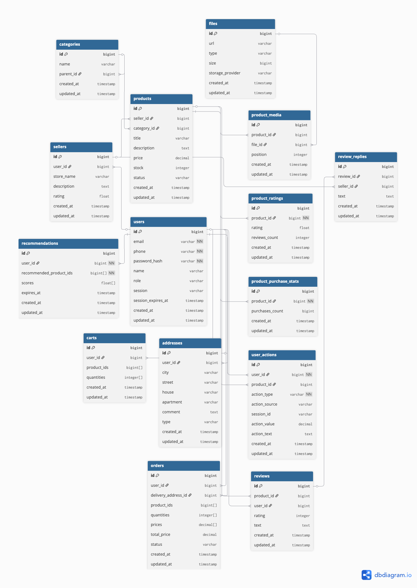

# Highload Ozon

## 1. Тема и целевая аудитория

### 1.1 Тема

Ozon — один из крупнейших маркетплейсов в России, предоставляющий инфраструктуру для взаимодействия между продавцами и конечными покупателями.

### 1.2 Функционал MVP:

**Для покупателя:**

- Регистрация, авторизация
- Просмотр каталога товаров
- Получение персональных рекомендаций товаров
- Поиск товаров
- Добавление товаров в корзину
- Оформление заказа
- Возможность оставить оценку и отзыв на товар

**Для продавца:**

- Регистрация, авторизация
- Добавление товаров на платформу
- Просмотр отзывов на свои товары
- Ответы на отзывы покупателей

### 1.3 Целевая аудитория

- **География:** более 95% пользователей приходятся на Россию
- **Размер аудитории:** [[1]](https://mediascope.net/data/#internet)
  - Месячный охват — 83 млн человек
  - Дневной охват — 43 млн человек

- **Гендерное распределение:** [[2]](https://delovoymir.biz/specifika-auditorii-raznyh-marketpleysov.html)
  - Женщины — 55%
  - Мужчины — 45%

- **Средний возраст пользователя:** 41 год
- **Среднее количество заказов:** 27 заказов в год [[3]](https://corp.ozon.ru/ru/sth/ebitda-ozon-v-1-kvartale-2025-goda-prevysila-32-mlrd-rubley-abdaa2d8)

## 2. Расчет нагрузки

### Продуктовые метрики

| Метрика                               | Значение   | Источник                                                                                                |
| ------------------------------------- | ---------- | ------------------------------------------------------------------------------------------------------- |
| MAU                                   | 83 000 000 | [[1]](https://mediascope.net/data/#internet)                                                            |
| DAU                                   | 43 000 000 | [[1]](https://mediascope.net/data/#internet)                                                            |
| Среднее заказов на пользователя в год | 27         | [[3]](https://corp.ozon.ru/ru/sth/ebitda-ozon-v-1-kvartale-2025-goda-prevysila-32-mlrd-rubley-abdaa2d8) |
| Активные продавцы                     | 600 000    | [[3]](https://corp.ozon.ru/ru/sth/ebitda-ozon-v-1-kvartale-2025-goda-prevysila-32-mlrd-rubley-abdaa2d8) |
| Оставляют отзыв                       | 19%        | [[4]](https://t-j.ru/opros-pro-otzyvy-rez/?utm_referrer=https%3A%2F%2Fwww.google.com%2F)                |
| Оставляют оценку                      | 36%        | [[4]](https://t-j.ru/opros-pro-otzyvy-rez/?utm_referrer=https%3A%2F%2Fwww.google.com%2F)                |
| Доля брошенных корзин                 | 70%        | [[5]](https://www.retailcrm.ru/blog/kak-sokratit-procent-broshennyh-korzin)                             |

#### Среднее количество действий пользователя по типам в день

| Тип действия              | Формула расчета              | Значение в день |
| ------------------------- | ---------------------------- | --------------- |
| Просмотр товаров          | 43 000 000 × 3 × 10          | 1 290 000 000   |
| Персональные рекомендации | 43 000 000 × 3 × 10          | 1 290 000 000   |
| Поиск товаров             | 43 000 000 × 3 × 2           | 258 000 000     |
| Оформление заказа         | 27 / 365 × 43 000 000        | 3 180 822       |
| Добавление в корзину      | 3 180 822 × 2.5 / 0.3        | 26 507 350      |
| Оценка товара             | 3 180 822 × 2.5 × 0.5 × 0.36 | 1 431 147       |
| Отзыв на товар            | 3 180 822 × 2.5 × 0.5 × 0.19 | 755 391         |
| Ответ продавца на отзыв   | 755 391 × 0.5                | 377 696         |
| Авторизация пользователя  | 43 000 000 × 0.05            | 2 150 000       |
| Регистрация пользователя  | 43 000 000 × 0.001           | 43 000          |
| Авторизация продавца      | 600 000 × 0.5                | 300 000         |
| Регистрация продавца      | 600 000 × 0.001              | 600             |
| Добавление товаров        | 600 000 \* 1                 | 600 000         |

### Технические метрики

#### RPS

Формула для расчета:

`Средний RPS = среднее количество действий пользователя по типам в день / 86400`

| Тип запроса               | Средний RPS | Пиковый RPS (x2) [[6]](https://habr.com/ru/companies/ozontech/articles/664472/) |
| ------------------------- | ----------- | ------------------------------------------------------------------------------- |
| Просмотр товаров          | 14 930      | 29 860                                                                          |
| Персональные рекомендации | 14 930      | 29 860                                                                          |
| Поиск товаров             | 2 986       | 5 972                                                                           |
| Оформление заказа         | 36.8        | 73.6                                                                            |
| Добавление в корзину      | 307         | 614                                                                             |
| Оценка товара             | 16.6        | 33.2                                                                            |
| Отзыв на товар            | 8.7         | 17.4                                                                            |
| Ответ продавца на отзыв   | 4.37        | 8.74                                                                            |
| Авторизация пользователя  | 24.9        | 49.8                                                                            |
| Регистрация пользователя  | 0.5         | 1.0                                                                             |
| Авторизация продавца      | 3.47        | 6.94                                                                            |
| Регистрация продавца      | 3.47        | 6.94                                                                            |
| Добавление товаров        | 6.94        | 13.88                                                                           |
| **Итого**                 | ~33 259     | ~66 518                                                                         |

#### Объем хранилища

| Тип данных       | Средний размер | Количество объектов | Общий объем (ТБ) | Прирост в день (кол-во) | Прирост в день (ГБ) | Прирост в месяц (ГБ) | Прирост в год (ГБ) |
| ---------------- | -------------- | ------------------- | ---------------- | ----------------------- | ------------------- | -------------------- | ------------------ |
| Пользователи     | 2 КБ           | 83 000 000          | 0.155            | 43 000                  | 0.082               | 2.46                 | 29.52              |
| Продавцы         | 3 КБ           | 600 000             | 0.0017           | 600                     | 0.0017              | 0.051                | 0.612              |
| Товары           | 2 КБ           | 250 000 000         | 0.466            | 600 000                 | 1.1444              | 34.332               | 411.984            |
| Товары медиа     | 22.5 МБ        | 250 000 000         | 5 364            | 600 000                 | 13 184.8            | 395 544              | 4 746 528          |
| Корзины          | 2 КБ           | 26 507 350          | 0.0494           | 10 602 940              | 20.41               | 612.3                | 7 347.6            |
| Заказы           | 3 КБ           | 1 160 000 030       | 0.0032           | 3 180 822               | 9.54                | 286.2                | 3 434.4            |
| Оценки           | 0.5 КБ         | 522 368 655         | 0.00024          | 1 431 147               | 0.70                | 21.0                 | 252.0              |
| Отзывы           | 1 КБ           | 275 717 715         | 0.00026          | 755 391                 | 0.72                | 21.6                 | 259.2              |
| Ответы продавцов | 1 КБ           | 137 859 040         | 0.00013          | 377 696                 | 0.36                | 10.8                 | 129.6              |
| История поиска   | 0.2 КБ         | 15 480 000 000      | 0.0029           | 258 000 000             | 49.21               | 1 476.3              | 17 715.6           |
| **Итого**        |                |                     | **5 364.6788**   | **277 592 596**         | **13 266.9671**     | **398 008.043**      | **4 776 108.516**  |

Средний размер медиа одного товара рассчитан следующим образом:  
5 фотографий по 0.5 МБ,  
1 видео размером 20 МБ

Количество заказов, оценок, отзывов и ответов продавцов рассчитано за год

История поиска за 2 месяца

#### Сетевой трафик

Формула для расчета:

`Пиковое потребление = пиковый RPS * средний размер ответа (Кб) * 8 * 1024 / 1 000 000 000  ~ пиковый RPS * средний размер ответа (Кб) / 122070 `

`Суточный трафик = запросов в день * средний размер ответа (Кб) / (1024 * 1024)`

| Тип запроса                   | Средний размер ответа (КБ) | Пиковое потребление (Гбит/с)          | Суточный трафик (ГБ/сутки)                        |
| ----------------------------- | -------------------------- | ------------------------------------- | ------------------------------------------------- |
| Просмотр информации о товарах | 2                          | 29 860 \* 2 / 122070 ≈ 0.489          | 1 290 000 000 * 2 / (1024*1024) ≈ 2 460           |
| Просмотр медиа товаров        | 23 040                     | 29 860 \* 23 040 / 122070 ≈ 5 633.652 | 1 290 000 000 * 23 040 / (1024*1024) ≈ 28 344 727 |
| Персональные рекомендации     | 200                        | 29 860 \* 200 / 122070 ≈ 48.925       | 1 290 000 000 * 200 / (1024*1024) ≈ 12 298        |
| Поиск товаров                 | 200                        | 5 972 \* 200 / 122070 ≈ 9.785         | 258 000 000 * 200 / (1024*1024) ≈ 49 210          |
| Оформление заказа             | 3                          | 73.6 \* 3 / 122070 ≈ 0.00181          | 3 180 822 * 3 / (1024*1024) ≈ 9.10                |
| Добавление в корзину          | 2                          | 614 \* 2 / 122070 ≈ 0.01006           | 26 507 350 * 2 / (1024*1024) ≈ 50.6               |
| Оценка товара                 | 1                          | 33.2 \* 1 / 122070 ≈ 0.000272         | 1 431 147 * 1 / (1024*1024) ≈ 1.37                |
| Отзыв на товар                | 2                          | 17.4 \* 2 / 122070 ≈ 0.000285         | 755 391 * 2 / (1024*1024) ≈ 1.44                  |
| Ответ продавца на отзыв       | 2                          | 8.74 \* 2 / 122070 ≈ 0.000143         | 377 696 * 2 / (1024*1024) ≈ 0.72                  |
| Авторизация пользователя      | 1                          | 49.8 \* 1 / 122070 ≈ 0.000408         | 2 150 000 * 1 / (1024*1024) ≈ 2.06                |
| Регистрация пользователя      | 2                          | 1.0 \* 2 / 122070 ≈ 0.0000164         | 43 000 * 2 / (1024*1024) ≈ 0.082                  |
| Авторизация продавца          | 1                          | 6.94 \* 1 / 122070 ≈ 0.0000568        | 300 000 * 1 / (1024*1024) ≈ 0.286                 |
| Регистрация продавца          | 3                          | 6.94 \* 3 / 122070 ≈ 0.000171         | 600 * 3 / (1024*1024) ≈ 0.00172                   |
| Добавление товаров            | 2                          | 13.88 \* 2 / 122070 ≈ 0.000227        | 600 000 * 2 / (1024*1024) ≈ 1.145                 |
| **Итого**                     | -                          | ~ 5 693.354                           | ~ 28 461 107                                      |

## Глобальная балансировка нагрузки

### Функциональное разбиение по доменам

| Домен          | Назначение                                  |
| -------------- | ------------------------------------------- |
| www.ozon.ru    | Основной интерфейс для покупателей          |
| seller.ozon.ru | Основной интерфейс для продавцов            |
| api.ozon.ru    | API для мобильных приложений и веб-клиентов |

### Расположение датацентров

Большая часть аудитории (более 95%) находится в России. Пользователи маркетплейса распределены практически по всей территории страны, что видно из распределения кластеров [[7]](https://dostavka.mphub.ru/blog/klastery-i-sklady-ozon-adresa-prioritety-karta-pokrytija/). Поэтому рационально разместить ДЦ в Москве, Санкт-Петербурге, Екатеринбурге и Новосибирске.

### Схема глобальной балансировки

Для автоматического и оптимального распределения пользовательских запросов между ДЦ предлагается использовать схему балансировки BGP Anycast.

## Локальная балансировка нагрузки

Используем трёхуровневую схему балансировки:

**Client → L4 → L7 → Backend**

### L4

После попадания трафика в ДЦ L4-балансировщик (LVS) распределяет соединения на ноды Nginx (L7) с помощью Virtual Server via Direct Routing (DSR). Алгоритм балансировки: Least Connections.

Для обеспечения отказоустойчивости применяется Keepalived: один балансировщик работает как главный, остальные — резервные. Если главный балансировщик выходит из строя, один из резервных автоматически берёт на себя его функции. Кроме того, Keepalived выполняет проверку работоспособности компонентов и может осуществлять логирование.

**Формула резервирования:** N\*2

### L7

Трафик с L4 принимают ноды Nginx. Они выполняют SSL Termination с использованием TLS session ticket, который позволяет клиенту повторно подключаться без полного TLS handshake. После расшифровки HTTPS-запросы распределяются на инстансы бэкенда. Алгоритм балансировки: Least Connections.

**Формула резервирования:** N+1

### Backend

Кластером инстансов бэкенда управляет Kubernetes.

**Формула резервирования:** N+1

## Логическая схема БД

| Таблица | Описание |
|---|---|
| `users` | Общая информация о пользователях |
| `sellers` | Информация о продавцах и их магазинах |
| `products` | Основная информация о товарах |
| `categories` | Категории товаров |
| `product_media` | Связь товаров с медиафайлами |
| `files` | Информация о файлах (изображения товаров и т.д.) |
| `product_ratings` | Агрегированная информация о рейтинге товара и количестве отзывов |
| `product_purchase_stats` | Агрегированная информация о количестве покупок товара |
| `carts` | Корзины пользователей |
| `orders` | Заказы пользователей |
| `addresses` | Адреса доставки |
| `reviews` | Отзывы и оценки пользователей о товарах |
| `review_replies` | Ответы продавцов на отзывы покупателей |
| `user_actions` | Журнал действий пользователей для аналитики |
| `recommendations` | Персональные рекомендации товаров для пользователя |

### Расчет размеров таблиц и QPS

| Название таблицы | Расчет размера строки | Количество строк | Размер таблицы | Нагрузка на запись (QPS, пик) | Нагрузка на чтение (QPS, пик) |
|---|---|---:|---:|---:|---:|
| **users** | `id(8) + email(255) + phone(20) + password_hash(60) + name(100) + role(20) + session(256) + session_expires_at(8) + created_at/updated_at(16)`  **≈ 743 Б** | 83 млн | **≈ 57.4 ГБ** | **57.7** | **56.7** |
| **addresses** | `id(8) + user_id(8) + city(100) + street(200) + house(20) + apartment(20) + comment(500) + type(20) + created_at/updated_at(16)`  **≈ 892 Б** | 166 млн | **≈ 137.9 ГБ** | **3.7** | **73.6** |
| **files** | `id(8) + url(500) + type(50) + size(8) + storage_provider(50) + created_at/updated_at(16)`  **≈ 632 Б** | 1.5 млрд | **≈ 882.9 ГБ** | **83.3** | **65 694.4** |
| **sellers** | `id(8) + user_id(8) + store_name(255) + description(1000) + rating(8) + created_at/updated_at(16)`  **≈ 1.27 КБ** | 600 000 | **≈ 0.72 ГБ** | **0.01** | **6.9** |
| **categories** | `id(8) + name(100) + parent_id(8) + created_at/updated_at(16)`  **≈ 132 Б** | < 100 000 | **< 13 МБ** | **редко** | **35 833.3** |
| **products** | `id(8) + seller_id(8) + category_id(8) + title(255) + description(2000) + price(8) + stock(4) + status(20) + created_at/updated_at(16)`  **≈ 2.27 КБ** | 250 млн | **≈ 541.8 ГБ** | **13.9** | **65 694.4** |
| **product_media** | `id(8) + product_id(8) + file_id(8) + position(2) + created_at/updated_at(16)`  **≈ 42 Б** | 1.5 млрд | **≈ 58.7 ГБ** | **83.3** | **65 694.4** |
| **product_ratings** | `id(8) + product_id(8) + rating(8) + reviews_count(4) + created_at/updated_at(16)`  **≈ 44 Б** | 250 млн | **≈ 10.2 ГБ** | **33.1** | **65 694.4** |
| **product_purchase_stats** | `id(8) + product_id(8) + purchases_count(8) + created_at/updated_at(16)`  **≈ 40 Б** | 250 млн | **≈ 9.3 ГБ** | **184.1** | **29 861.1** |
| **user_actions** | `id(8) + user_id(8) + product_id(8) + action_type(50) + action_source(50) + session_id(100) + action_value(8) + action_text(500) + created_at/updated_at(16)`  **≈ 750 Б** | ≈ 1.05 трлн | **≈ 715 ТБ** | **66 483.0** | **6 648.3** |
| **recommendations** | `id(8) + user_id(8) + recommended_product_ids + scores + expires_at(8) + created_at/updated_at(16)`  **≈ 360 Б** | 83 млн | **≈ 27.8 ГБ** | **1 921.3** | **1 493.1** |
| **carts** | `id(8) + user_id(8) + product_ids + quantities + created_at/updated_at(16)`  **≈ 62 Б** | 43 млн | **≈ 2.5 ГБ** | **613.6** | **306.8** |
| **orders** | `id(8) + user_id(8) + delivery_address_id(8) + product_ids + quantities + prices + total_price(8) + status(20) + created_at/updated_at(16)`  **≈ 118 Б** | 1.16 млрд | **≈ 127.5 ГБ** | **73.6** | **73.6** |
| **reviews** | `id(8) + product_id(8) + user_id(8) + rating(1) + text(1000) + created_at/updated_at(16)`  **≈ 1.02 КБ** | ≈ 276 млн | **≈ 267.6 ГБ** | **17.5** | **2 986.1** |
| **review_replies** | `id(8) + review_id(8) + seller_id(8) + text(1000) + created_at/updated_at(16)`  **≈ 1.02 КБ** | ≈ 138 млн | **≈ 133.5 ГБ** | **8.7** | **2 986.1** |

## Источники:

1. https://mediascope.net/data/#internet
2. https://delovoymir.biz/specifika-auditorii-raznyh-marketpleysov.html
3. https://corp.ozon.ru/ru/sth/ebitda-ozon-v-1-kvartale-2025-goda-prevysila-32-mlrd-rubley-abdaa2d8
4. https://t-j.ru/opros-pro-otzyvy-rez/?utm_referrer=https%3A%2F%2Fwww.google.com%2F
5. https://www.retailcrm.ru/blog/kak-sokratit-procent-broshennyh-korzin
6. https://habr.com/ru/companies/ozontech/articles/664472/
7. https://dostavka.mphub.ru/blog/klastery-i-sklady-ozon-adresa-prioritety-karta-pokrytija/
